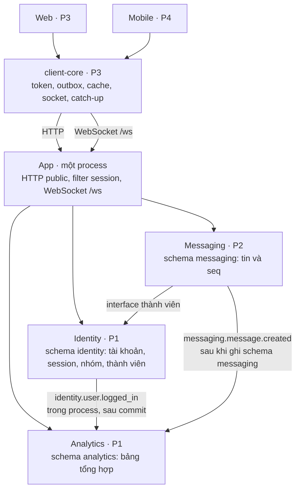

# Timeline 8 tuần

Bức tranh để giữ hướng đi. Việc chi tiết và điều kiện xong nằm trên issue. File này chỉ nói hệ thống chạy ra sao, tuần nào URL cloud phải chứng minh được việc gì, và issue nào thuộc tuần đó.

Tuần 1 bắt đầu thứ Hai 28/09/2026, tuần hợp đồng [#2](https://github.com/nanangn57/haloZalo/issues/2) được chốt. Lịch môn khác thì dịch cột ngày, giữ nguyên thứ tự tuần.

Hạng 2 làm sau khi đường demo hạng 1 chạy trên URL: [#21](https://github.com/nanangn57/haloZalo/issues/21) [#22](https://github.com/nanangn57/haloZalo/issues/22) [#23](https://github.com/nanangn57/haloZalo/issues/23) [#24](https://github.com/nanangn57/haloZalo/issues/24) [#25](https://github.com/nanangn57/haloZalo/issues/25) [#26](https://github.com/nanangn57/haloZalo/issues/26) [#27](https://github.com/nanangn57/haloZalo/issues/27) [#28](https://github.com/nanangn57/haloZalo/issues/28).

## Hệ thống chạy thế nào

Map này là quyết định chung, đã ghi ở [decisions.md](contract/decisions.md). Mỗi người build bên trong module mình giữ. Đường nối giữa các module thuộc hợp đồng: P1 sửa `doc/contract/` trước, người còn lại sinh type từ file đó. Không ai tự thêm một cửa public, tự đọc bảng schema khác, hay tự đổi shape của `Message`.



Cả ba schema nằm trên một instance MySQL. P4 giữ lệnh deploy, đưa một process và MySQL đó lên một URL mỗi tuần.

| Việc | Ai quyết |
|---|---|
| Module nào tồn tại, schema nào, cổng public, shape `Message`, phong bì event | Cả nhóm, qua `doc/contract/`. P1 là người sửa file |
| Code, bảng, handler bên trong một module | Người giữ thư mục đó |
| Web và mobile lệch cách đồng bộ | Không ai. Cả hai gọi cùng `clients/core` |
| Tách lại thành nhiều process | Không. Lệnh deploy giữ một process và một MySQL |

| Thành phần | Giữ gì | Nói chuyện với ai |
|---|---|---|
| app | Cửa HTTP public và WebSocket. Không giữ session | Filter gọi Identity trong process, rồi vào handler |
| identity | Tài khoản, session, nhóm, thành viên. Schema `identity` | Cấp session id. Phát event khi login, tạo nhóm. Cho Messaging hỏi thành viên qua interface |
| messaging | Hội thoại, tin, `seq`, file. Schema `messaging`. Socket trong bộ nhớ process | Ghi tin xong mới phát `messaging.message.created`. Hỏi thành viên qua interface của Identity |
| analytics | Bảng tổng hợp. Schema `analytics` | Chỉ nhận event trong process. Không quét bảng schema `messaging` |
| client-core | Token, outbox, cache, socket, catch-up | Web và mobile dùng chung một thư viện |

Một tin text đi như sau:

1. Client sinh `clientMsgId`, gửi `POST /conversations/{conversationId}/messages` tới app, kèm access token.
2. Filter đưa session id cho Identity trong cùng process. Không có dòng hoặc hết hạn thì app trả 401 và dừng. Còn hạn thì gắn `userId` rồi vào handler.
3. Messaging ghi schema `messaging`, gán `seq`. Cùng người gửi và cùng `clientMsgId` thì trả tin cũ, không tăng `seq`.
4. Commit xong mới phát phong bì `messaging.message.created`. WebSocket đẩy nguyên phong bì đó tới client đang mở. Analytics nhận cùng event để cộng bảng tổng hợp.

Đọc ở một thiết bị ghi mốc đã đọc theo user và hội thoại. Thiết bị kia hết unread vì đọc mốc đó, không vì sửa tin đã gửi. Mất socket thì client nhìn lỗ `seq` và gọi catch-up; catch-up trả cùng schema `Message`.

Module không đọc bảng schema khác. Messaging biết ai thuộc nhóm bằng interface của Identity, đã ghi ở [decisions.md](contract/decisions.md).

## Cách xây

Mỗi tuần thêm một việc người dùng làm được trên cùng URL cloud, bằng cùng một lệnh deploy. Hợp đồng đổi trước ở `doc/contract/`, người còn lại sinh type từ file đó.

Đường tới buổi demo bị chấm trực tiếp:

```
token → app → nhóm và tìm user → gửi tin → realtime
  → seq, đã đọc, catch-up → web hai phiên → APK dùng cùng core
```

Media, analytics và FCM đi cạnh đường này sau khi gửi tin đã có. Trượt một tuần thì dời issue sang tuần sau. URL tuần đó vẫn phải lên, với phần đã chạy được.

## Từng tuần

### Tuần 1 · 28/09–04/10 · Có cửa

[#2](https://github.com/nanangn57/haloZalo/issues/2) đã xong.

| Người | Issue | Xong khi |
|---|---|---|
| P1 | [#3](https://github.com/nanangn57/haloZalo/issues/3) | Đăng ký, đăng nhập trả token; API bảo vệ từ chối request không token |
| P2 | [#30](https://github.com/nanangn57/haloZalo/issues/30) | Ghi một tin TEXT; gửi lại cùng `clientMsgId` không tăng `seq` |
| P3 | [#31](https://github.com/nanangn57/haloZalo/issues/31) | Web mở màn login đúng `LoginRequest`; core có chỗ giữ token |
| P4 | [#4](https://github.com/nanangn57/haloZalo/issues/4) | Một URL AWS, deploy bằng một lệnh, response sống |

- [ ] URL public mở được

Tuần này bốn người chưa cần chờ nhau. `conversationId` do client sinh.

### Tuần 2 · 05/10–11/10 · Đăng nhập trên URL, có nhóm

| Người | Issue | Xong khi |
|---|---|---|
| P1 | [#7](https://github.com/nanangn57/haloZalo/issues/7), [#5](https://github.com/nanangn57/haloZalo/issues/5) | Mọi request có token đi qua filter của app; tạo nhóm, thêm và xoá thành viên, xem nhóm của mình |
| P2 | nối [#30](https://github.com/nanangn57/haloZalo/issues/30) vào HTTP của OpenAPI | `POST` tin TEXT đúng hợp đồng, vẫn nhận `conversationId` do client sinh |
| P3 | phần auth của [#13](https://github.com/nanangn57/haloZalo/issues/13) | Core gọi đăng nhập thật và giữ access token |
| P4 | deploy app và MySQL | Cùng lệnh tuần 1, URL làm được đăng ký và đăng nhập |

- [ ] Trên URL: đăng ký, đăng nhập, gọi `/me`
- [ ] OpenAPI có API nhóm trước khi web gọi

### Tuần 3 · 12/10–18/10 · Tìm được người và mở được hội thoại

| Người | Issue | Xong khi |
|---|---|---|
| P1 | [#6](https://github.com/nanangn57/haloZalo/issues/6), bắt đầu [#8](https://github.com/nanangn57/haloZalo/issues/8) | Tìm user; analytics ghi được login và tạo nhóm |
| P2 | [#9](https://github.com/nanangn57/haloZalo/issues/9) | Chat 1-1 và nhóm, text và emotion, lịch sử gần nhất; người ngoài nhóm bị chặn |
| P3 | [#14](https://github.com/nanangn57/haloZalo/issues/14) | Web đăng nhập, tìm user, tạo nhóm, quản lý thành viên |
| P4 | Cùng một MySQL, schema `identity` | URL làm được tạo nhóm |

- [ ] Trên URL: tìm user, tạo nhóm, xem danh sách nhóm

### Tuần 4 · 19/10–25/10 · Tin hiện không cần tải lại

| Người | Issue | Xong khi |
|---|---|---|
| P1 | [#8](https://github.com/nanangn57/haloZalo/issues/8) nhận `messaging.message.created` | Một request thống kê không quét bảng message |
| P2 | [#10](https://github.com/nanangn57/haloZalo/issues/10) | Ghi DB xong mới fan-out; client đang mở nhận tin |
| P3 | [#15](https://github.com/nanangn57/haloZalo/issues/15), socket và outbox trong [#13](https://github.com/nanangn57/haloZalo/issues/13) | Web gửi text và emotion; tin mới tự hiện; gửi lại không trùng |
| P4 | Cùng một process | URL có WebSocket `/ws` |

- [ ] Trên URL: gửi text, tin hiện ở tab đang mở
- [ ] Có đường đo p95 gửi → hiện cho text

### Tuần 5 · 26/10–01/11 · Hai phiên web khớp nhau

| Người | Issue | Xong khi |
|---|---|---|
| P1 | Sửa OpenAPI cho catch-up và mốc đã đọc, trước [#11](https://github.com/nanangn57/haloZalo/issues/11) | Schema lịch sử và catch-up là `Message`; mốc đã đọc không nằm trên tin |
| P2 | [#11](https://github.com/nanangn57/haloZalo/issues/11) | `seq` từng hội thoại; mở lại lấy đủ tin thiếu; đọc một thiết bị thì thiết bị kia hết unread |
| P3 | [#17](https://github.com/nanangn57/haloZalo/issues/17), catch-up trong [#13](https://github.com/nanangn57/haloZalo/issues/13) | Hai phiên web cùng account, cùng hội thoại, cùng thứ tự, cùng trạng thái đã đọc |
| P4 | URL giữ được WebSocket qua deploy | Hai tab trên URL cloud khớp nhau |

- [ ] Demo được trên URL: hai tab, một account, đọc một bên thì bên kia hết unread
- [ ] Ngắt mạng một tab rồi vào lại, tin thiếu được bù, không trùng

### Tuần 6 · 02/11–08/11 · Ảnh trên web, APK đăng nhập được

| Người | Issue | Xong khi |
|---|---|---|
| P1 | [#8](https://github.com/nanangn57/haloZalo/issues/8) đủ event upload | Analytics ghi upload media từ event |
| P2 | [#12](https://github.com/nanangn57/haloZalo/issues/12) | Ảnh, tài liệu, video qua signed URL; quá dung lượng bị từ chối; `MessageBase` không thêm field bắt buộc |
| P3 | [#16](https://github.com/nanangn57/haloZalo/issues/16) | Web gửi và xem media trong hội thoại |
| P4 | [#18](https://github.com/nanangn57/haloZalo/issues/18) | APK đăng nhập cùng API, chat text và emotion bằng client-core, token trong secure storage |

- [ ] Trên URL: gửi một ảnh trong hội thoại và xem lại được
- [ ] APK cài được và đăng nhập cùng tài khoản với web

### Tuần 7 · 09/11–15/11 · Web và mobile cạnh nhau

| Người | Issue | Xong khi |
|---|---|---|
| P1 | Vá quyền nhóm nếu demo lệch | Người ngoài nhóm không gửi được, trên cả hai client |
| P2 | Vá fan-out và catch-up theo demo tuần 5 | Mobile mở lại không mất tin |
| P3 | Cache trong [#13](https://github.com/nanangn57/haloZalo/issues/13) | Mở lại hội thoại không trắng màn hình |
| P4 | [#19](https://github.com/nanangn57/haloZalo/issues/19), [#20](https://github.com/nanangn57/haloZalo/issues/20) | App chọn file; OS đóng socket rồi mở lại vẫn đủ tin; web và mobile cùng lịch sử và cùng đã đọc |

- [ ] Demo được: gửi ở mobile thì web thấy, gửi ở web thì mobile thấy, đọc một bên thì bên kia hết unread

### Tuần 8 · 16/11–22/11 · Buổi chấm

| Người | Issue | Xong khi |
|---|---|---|
| P4 | [#29](https://github.com/nanangn57/haloZalo/issues/29) | Có chỗ xem service sống, một lần load test đường text, kết quả ghi được |
| P4 | [#28](https://github.com/nanangn57/haloZalo/issues/28) nếu đường hạng 1 đã chắc | Push khi app không chạy nền |
| Cả nhóm | Hạng 2 còn lại, nếu còn ngày | Profile, bạn bè, dashboard, typing, reaction, role admin |

- [ ] URL cloud là bản demo, deploy lại bằng một lệnh
- [ ] Text không nhân đôi khi retry, thứ tự khớp `seq`, p95 có số đo
- [ ] Hai thiết bị cạnh nhau thấy cùng hội thoại, cùng thứ tự, cùng đã đọc

## Đọc mỗi đầu tuần

Mở tuần đang tới trong file này. Đối chiếu issue. URL cột demo là việc chung, dù task của từng người chưa xong hết. Thêm API trong tuần thì P1 sửa `doc/contract/` trước.
